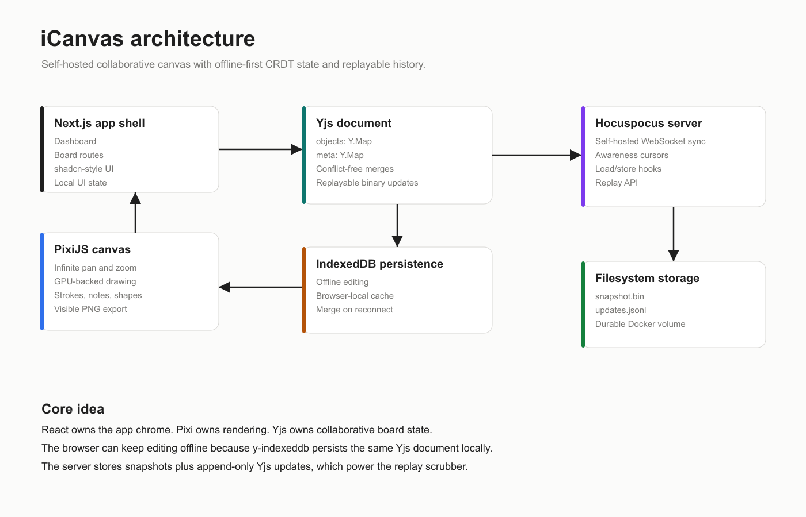

# iCanvas Architecture



## Design Goal

iCanvas is designed to be a real-time collaborative canvas that remains usable after the hackathon. The architecture favors simple, explainable pieces that can be self-hosted:

- React and Next.js for the application shell.
- PixiJS for rendering and pointer-heavy canvas work.
- Yjs for collaborative state.
- y-indexeddb for offline persistence.
- Hocuspocus for self-hosted WebSocket sync.
- Filesystem storage for board snapshots and replay logs.

## Monorepo Structure

```txt
iCanvas/
  apps/
    web/        Next.js frontend
    sync/       Hocuspocus sync and replay server
  packages/
    shared/     shared board types and constants
  docs/         product, architecture, and hackathon documentation
```

## Frontend Responsibilities

The frontend lives in `apps/web`.

It is responsible for:

- Dashboard and board routing.
- Toolbar, sidebar, replay controls, radar, and style controls.
- Mounting PixiJS into a React page.
- Translating pointer coordinates between screen and canvas world space.
- Creating and updating Yjs objects.
- Scoping board documents with server-authorized account membership.
- Persisting the Yjs document locally with IndexedDB.
- Rendering remote cursor awareness.
- Reconstructing replay state from logged Yjs updates.
- Running Matter.js only for locally owned physics objects.
- Sending authenticated board and error-report API requests.

## Canvas Rendering

PixiJS owns the canvas. React does not render canvas objects into the DOM.

The camera is represented as:

```ts
type Camera = {
  x: number;
  y: number;
  zoom: number;
};
```

Screen-to-world conversion:

```ts
world.x = (screen.x - camera.x) / camera.zoom;
world.y = (screen.y - camera.y) / camera.zoom;
```

World-to-screen conversion:

```ts
screen.x = world.x * camera.zoom + camera.x;
screen.y = world.y * camera.zoom + camera.y;
```

This keeps pan and zoom simple and makes object hit-testing deterministic.

## Collaborative State

Canvas state is stored in a Yjs document:

```ts
objects: Y.Map<CanvasObject>
meta: Y.Map<BoardMetadata>
```

Important constants:

```ts
BOARD_OBJECTS_KEY = "objects";
BOARD_META_KEY = "meta";
```

Canvas object types:

- `stroke`
- `note`
- `shape`
- `gravity-well`

Board metadata:

- `title`
- `seededDemoAt`
- `updatedAt`

## Authentication And Board ACLs

Accounts, boards, and memberships are stored in `SYNC_DATA_DIR/security.json` with restrictive file
permissions. Passwords are salted scrypt hashes. The web app stores a short-lived signed session token
locally and sends it as a Bearer token for HTTP APIs and as the Hocuspocus provider token for WebSocket
authentication.

Boards use URLs like:

```txt
/boards/:boardId
```

`onAuthenticate` verifies the session and board membership before a document is opened. It marks viewer
connections read-only at the Hocuspocus connection layer; owners and editors may write. Replay is guarded
by the same ACL. URLs are identifiers only and never grant access.

Object locks are persisted collaboration hints, used by the UI to prevent accidental edits by another
member. They are not presented as a substitute for board-level authorization.

React state is used for local UI only: selected tool, selected object, camera, editor state, replay panel state, and temporary UI feedback.

## Offline Model

The browser uses `y-indexeddb` to persist the Yjs document locally.

This means:

- A user can continue editing after the network drops.
- The browser stores changes locally.
- When the connection returns, Yjs merges the local document with the remote document.

There is no custom conflict-resolution system in the app. Yjs handles the merge layer.

## Sync Server

The sync server lives in `apps/sync`.

It uses Hocuspocus to:

- Accept Yjs WebSocket connections.
- Load a stored Yjs snapshot for a board.
- Store debounced snapshots.
- Capture every update for replay.
- Serve health and replay HTTP endpoints.

Runtime endpoints:

```txt
WebSocket sync: ws://localhost:1234
Health:         http://localhost:1234/health
Replay API:     http://localhost:1234/api/boards/:boardId/replay
```

## Persistence

The sync server writes to `SYNC_DATA_DIR`.

For each board:

```txt
data/
  <encoded-board-id>/
    snapshot.bin
    updates.jsonl
```

`snapshot.bin` stores the latest compact Yjs state.

`updates.jsonl` stores append-only replay entries:

```ts
type ReplayUpdate = {
  timestamp: number;
  update: string; // base64 Yjs update
};
```

## Replay

Replay is built from the same updates used for sync.

The frontend:

1. Fetches updates from the replay endpoint.
2. Creates a fresh `Y.Doc`.
3. Applies updates in order using `Y.applyUpdate`.
4. Renders the reconstructed objects at the selected timeline index.
5. Can autoplay through updates with play/pause controls.

This avoids building a separate history model.

## Physics Ownership

Matter.js is a local simulation, not a second source of collaborative state. When a user grabs a
physics-enabled note or shape, iCanvas records that browser's Yjs client ID as `physics.ownerId`.
Only that client simulates the object and publishes its position and velocity to Yjs at roughly
18Hz; peers render those shared positions and never run a competing simulation. Ownership clears
when the object settles. This prevents the position fighting and teleporting that independent
per-client simulations cause.

Gravity wells are ordinary shared canvas objects. A positive well attracts and a negative well
repels locally owned moving bodies, so their settings also replay and synchronize normally.

## Presence And Radar

Presence is handled through Yjs Awareness, not through the persisted document.

Awareness includes:

- User identity.
- Cursor world position.
- Current viewport.

This is deliberately not stored in the board document because cursor movement should not pollute replay history.

The radar/minimap uses:

- Canvas object bounds.
- Current viewport bounds.
- Remote collaborator viewport rectangles.

Clicking the radar recenters the camera on that world position.

## Why This Architecture Wins

The architecture is compact enough to build quickly, but strong enough to demonstrate real engineering judgment:

- PixiJS keeps the canvas performant.
- Yjs prevents fragile custom sync logic.
- y-indexeddb makes offline editing cheap and robust.
- Hocuspocus keeps the backend self-hosted without reinventing WebSocket sync.
- Replay comes naturally from the Yjs update stream.

## Production Hardening Checklist

Before a real public launch:

- Set a unique, long `SYNC_AUTH_SECRET` and do not use the local fallback.
- Restrict `SYNC_ALLOWED_ORIGINS` to the deployed web origin.
- Back up `SYNC_BACKUP_DIR` off-host; the service writes latest snapshots there.
- Protect `/metrics` with `SYNC_METRICS_KEY`; monitor errors, requests, denials, and replay compactions.
- Replay logs are retained and capped with `SYNC_REPLAY_RETENTION_DAYS` and `SYNC_REPLAY_MAX_ENTRIES`.
- Add password reset/email verification and durable database/object storage as the user base grows.
