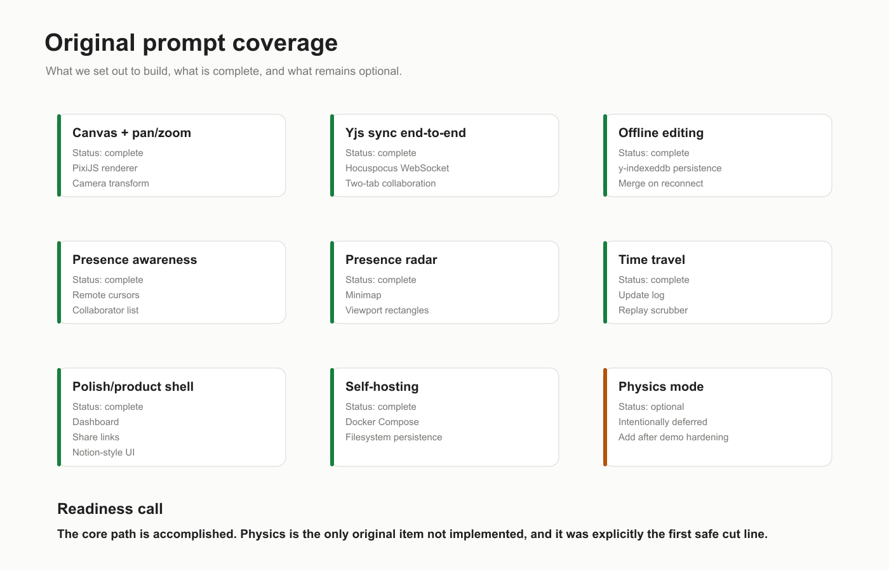

# Hackathon Readiness



## Original Intent

The original prompt asked for an ambitious solo, self-hosted collaborative infinite canvas with:

1. PixiJS rendering.
2. Next.js, TypeScript, Tailwind, and shadcn-style UI.
3. Yjs CRDT state.
4. y-indexeddb offline persistence.
5. Hocuspocus self-hosted sync.
6. Presence awareness.
7. Presence radar.
8. Time travel/replay.
9. Optional physics using Matter.js.
10. A polished demo path with explicit cut lines.

## What Is Complete

| Original target | Status | Notes |
| --- | --- | --- |
| PixiJS infinite canvas | Complete | Pixi owns the canvas; React owns UI chrome. |
| Pan and zoom | Complete | Camera transform converts screen/world coordinates. |
| Drawing tool | Complete | Freehand strokes are Yjs objects. |
| Notes and shapes | Complete | Sticky notes, rectangles, ellipses. |
| Next.js + TypeScript | Complete | Monorepo app under `apps/web`. |
| Tailwind + shadcn-style UI | Complete | Tailwind v4 with local UI primitives. |
| Yjs CRDT state | Complete | Board objects and metadata are in Yjs maps. |
| Offline persistence | Complete | y-indexeddb persists the board locally. |
| Hocuspocus sync | Complete | Self-hosted sync server under `apps/sync`. |
| Presence cursors | Complete | Awareness broadcasts user and cursor state. |
| Presence radar | Complete | Minimap shows board, viewport, and collaborator rectangles. |
| Time travel/replay | Complete | Server logs Yjs updates and frontend replays them. |
| Self-hosting | Complete | Docker Compose and durable data volume. |
| Polish | Complete enough | Dashboard, invited board access, seeded board, export, Notion-like theme. |
| Account and board security | Complete | Signed sessions, owner/editor/viewer ACLs, and Hocuspocus read-only viewers. |
| Resize handles | Complete | Notes and shapes can be resized from a handle. |
| Replay playback | Complete | Replay can be scrubbed or played. |
| Full-board PNG export | Complete | Export renders the full board content. |
| Physics mode | Complete | Matter.js toss/collision, client ownership handoff, and gravity wells. |

## Readiness Call

The original core plan and its optional physics stretch are accomplished. Physics remains deliberately
scoped so it cannot compromise the collaboration, offline, or replay demo path.

For winning odds, the current priority should be:

1. Browser QA with two tabs.
2. Deployment.
3. Rehearsed demo.
4. Rehearse the physics toss and gravity-well moment only after the core demo is stable.

## 90-Second Demo Script


### Setup

Run:

```bash
npm run dev
```

Open:

```txt
http://localhost:3001
```

Open a second tab after creating the board.

### Script

1. **Create:** Open the dashboard and create a new board.
2. **Seed:** Click **Seed demo board** to instantly show meaningful content.
3. **Invite:** Register a second account, invite it as an editor, then open the board in its session.
4. **Collaborate:** Draw or move an object in one tab and show it syncing in the other.
5. **Presence:** Move around and show cursors plus the radar viewport.
6. **Offline:** Stop the sync server, keep editing, and point out the offline banner.
7. **Reconnect:** Restart sync and show the state still exists.
8. **Replay:** Open replay history and scrub or play the timeline.
9. **Export:** Export the full board as PNG.

### Judge Line

> iCanvas is a self-hosted collaborative canvas that keeps working offline and can replay how a team reached its final idea.

## Why This Can Win

Many hackathon whiteboards stop at drawing. iCanvas has a stronger story:

- It is collaborative.
- It is offline-first.
- It is self-hosted.
- It has replayable history.
- It has a polished product loop.

The offline plus replay combination is the most important demo moment. It proves that the app is not just a canvas; it is a resilient shared memory surface.

## Cut Lines

If time is short:

1. Do not expand physics beyond the existing toss/collision/gravity well.
2. Do not expand rich text beyond its safe formatting controls.
3. Do not expand account flows before deployment hardening.
4. Do not expand export beyond full-board and selected-object crops.

Protect:

1. Live sync.
2. Offline editing.
3. Replay.
4. Shareable boards.
5. Seeded demo.

## Remaining Risk

The main risks before judging are operational, not architectural:

- Browser QA needs to verify the exact offline/reconnect demo.
- Deployment needs HTTPS/WSS configuration.
- Production needs a unique auth secret, restricted allowed origins, and off-host snapshot backups.

## Next Best Engineering Steps

1. Deploy to a real URL.
2. Configure WSS for the sync endpoint.
3. Configure production secrets, allowed origins, protected metrics, and backup destination.
4. Add arbitrary/multi-object crop controls.
5. Add physics presets and boundaries only if the core demo is fully stable.
