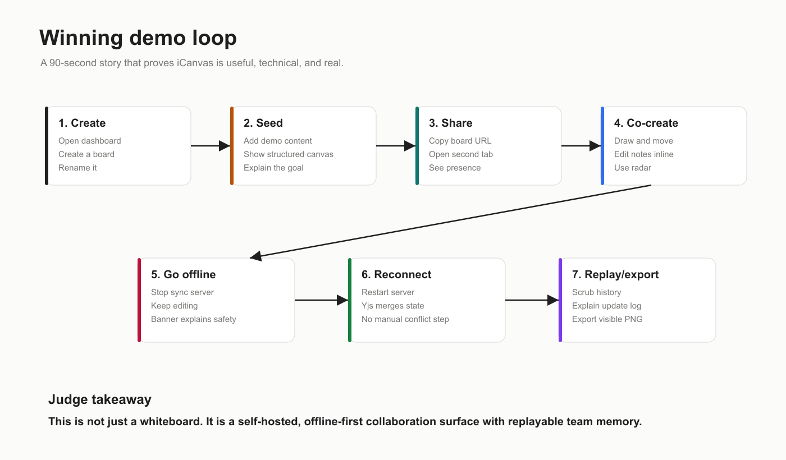

# iCanvas Product Documentation



## Product Summary

iCanvas is a self-hosted collaborative infinite canvas for visual teamwork. It is designed for teams that need to sketch ideas, drop notes, draw relationships, work together live, keep editing when the network goes away, and replay how the board evolved.

The product thesis is simple:

> A collaborative canvas should not lose the room's thinking when someone goes offline, reloads, or joins late.

iCanvas is built around that thesis. The board state is collaborative by default, persisted locally in the browser, synced through a self-hosted server, and replayable from an append-only update log.

## Who It Is For

iCanvas is useful for:

- Hackathon teams planning product flows.
- Product and engineering teams mapping architecture.
- Workshop facilitators collecting group ideas.
- Remote teams that need a lightweight whiteboard they can self-host.
- Anyone who wants a canvas that continues working offline.

## What You Can Do

Current capabilities:

- Create a board from the dashboard.
- Open a board at `/boards/:boardId`.
- Create account-backed boards with owner, editor, and viewer roles.
- Draw freehand strokes.
- Add sticky notes.
- Add rectangles and ellipses.
- Select, move, style, and delete objects.
- Edit sticky notes inline.
- Rename a board.
- Resize notes and shapes.
- See collaborator cursors and live users.
- Use the radar/minimap to understand where people are on the canvas.
- Keep editing with browser-local offline persistence.
- Reconnect and merge changes through Yjs.
- Replay the board's edit history with scrub or play/pause controls.
- Reset the demo board for rehearsals.
- Export the full board as PNG.
- Enable physics on notes or shapes, then toss them into each other.
- Add an attract or repel gravity well for a lightweight physics interaction.
- Run the whole system locally or self-host it with Docker Compose.

## How To Run It

From the project root:

```bash
cd /Users/mac/Desktop/iCanvas
npm install
npm run dev
```

Open:

```txt
http://localhost:3001
```

Useful local URLs:

```txt
Dashboard:   http://localhost:3001
Demo board:  http://localhost:3001/boards/demo-board
Sync health: http://localhost:1234/health
```

Run only the web app:

```bash
npm run dev:web
```

Run only the sync server:

```bash
npm run dev:sync
```

Before shipping:

```bash
npm run typecheck
npm run build
```

## How To Use The App

### 1. Create Or Open A Board

Open the dashboard and choose **Create board** or **Open demo**.

Each board has a URL:

```txt
/boards/:boardId
```

The URL identifies a board but is not a credential. Users must sign in, and the server only authorizes
owners, invited editors, and invited viewers. Board owners use **Board access** to invite an existing
iCanvas account by email. Viewers can follow changes but Hocuspocus marks their connection read-only.

### 2. Seed The Demo Board

On an empty board, click **Seed demo board**. This creates sample notes, shapes, and strokes so a judge or teammate immediately understands the product.

The seeded content is not fake UI. It is written into the same Yjs document as user-created objects, so it syncs, persists offline, and appears in replay.

### 3. Draw, Add Notes, And Shape Ideas

Use the top toolbar:

- Pointer: select, move, or pan.
- Pencil: draw strokes.
- Sticky note: add notes.
- Rectangle: add rectangular blocks.
- Ellipse: add oval blocks.

Double-click a note or select it and press **Edit note** to edit inline.

### 4. Collaborate Live

Open the same board in two browser tabs. Actions in one tab sync to the other through the Hocuspocus server.

Remote collaborators appear as:

- Cursors on the canvas.
- Names in the collaborator list.
- Viewport rectangles in the radar/minimap.

### 5. Work Offline

If the browser or sync server goes offline, iCanvas shows an offline/reconnect banner. Keep editing. The Yjs document is persisted locally with IndexedDB.

When the sync connection returns, Yjs exchanges state vectors and merges changes.

### 6. Replay The Board

Click **Replay history**. The sync server returns the append-only update log for the board. The frontend reconstructs the board by applying Yjs updates into a fresh replay document.

This lets a team show not only the final board, but the thinking path that led there.

### 7. Export PNG

Click **Export PNG**. The app exports the full board content as an image.

This is useful for:

- Sending a recap after a workshop.
- Adding the board to a project brief.
- Showing a quick artifact in a hackathon submission.

### 8. Rich Notes, Exports, And Physics

Double-click a sticky note to edit it inline. The compact editor supports bold, italic, and underline
formatting; iCanvas sanitizes the stored markup and renders a plain-text fallback in Pixi and PNG exports.

Use **Export selected PNG** for a tight single-object crop, or export the complete board when you need
the wider context.

Select a note, rectangle, or ellipse and choose **Enable physics** in the Style panel. Turn on
**Physics mode** in the Session panel, then drag and release the object to toss it. Physics-enabled
objects collide while the active client owns their simulation.

Choose the gravity-well tool in the toolbar to place an attractor. Select a well to switch it from
attract to repel. The well affects nearby, physics-enabled objects while their owner is simulating
them.

## The Product Story

iCanvas is intentionally not trying to be a complete Miro clone. The winning wedge is narrower:

1. Real collaborative canvas.
2. Offline-safe editing.
3. Replayable history.
4. Self-hosted infrastructure.

That combination is strong because it is both practical and technically interesting. Judges can understand the value in seconds, and engineers can see that the implementation has real depth.

## Current Limitations

- Password reset and email verification are not implemented yet.
- Invitations require the recipient to have already registered an account.
- Object locks are a collaboration control; server-enforced permissions are board-level owner/editor/viewer roles.
- PNG export supports a full board or one selected object, not an arbitrary multi-object crop.
- Physics mode is intentionally scoped to notes and shapes. Strokes remain static so drawing stays
  predictable.

## Recommended Next Product Steps

1. Add password reset, email verification, and audit history.
2. Add arbitrary/multi-object crop controls for PNG export.
3. Add rich-text attachments and collaborative text cursors.
4. Add per-object server-side policy if the product needs it beyond board ACLs.
5. Add physics presets and world boundaries after the demo loop is fully hardened.
